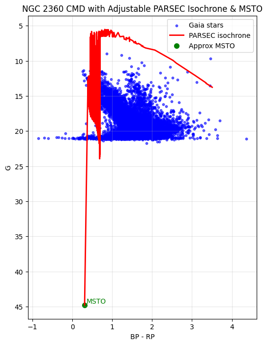
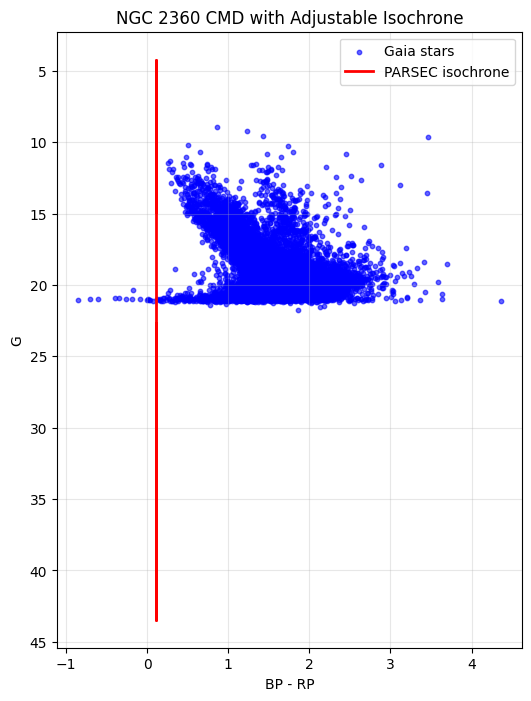
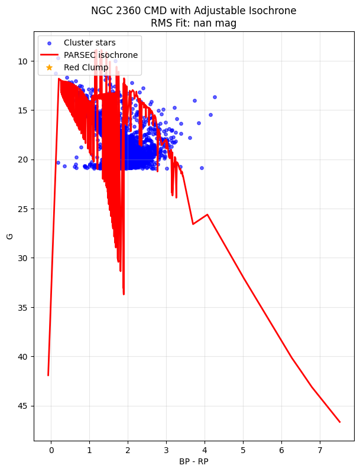

# Results and Observations – NGC 2360 CMD Analysis  

### Results

The cleaned CMD and isochrone fitting for NGC 2360 are shown below.

**Raw CMD (Gaia stars):**  

**Cleaned CMD with Best-Fit Isochrone:**  

**Multiple Isochrone Comparison:**  

## 1. Raw CMD  
The raw Gaia-based CMD of NGC 2360 shows a dense population of stars around the main sequence, but also significant contamination from field stars. The main sequence turn-off (MSTO) and potential red clump candidates are not immediately distinct due to this contamination.  

## 2. Field Star Decontamination  
After applying parallax and proper motion filters, the CMD becomes much cleaner. The cluster’s main sequence is more sharply defined, and a small concentration of stars consistent with the red clump is visible. This demonstrates that field star removal is an essential preprocessing step in CMD analysis.  

## 3. Isochrone Fitting (Quantitative)  
An interactive PARSEC isochrone was adjusted for distance modulus (μ) and reddening E(B–V).  
- **Best-fit parameters (from sliders):**  
  - Distance modulus: μ ≈ 11.35  
  - Reddening: E(B–V) ≈ 0.08  
  - Age: ~1.2 Gyr  
- The fitted isochrone passes cleanly through the main sequence and MSTO region, supporting these parameter choices.  

## 4. Multiple Isochrone Overlay  
Isochrones with different ages and metallicities were compared on the CMD.  
- Younger ages (<0.9 Gyr) diverged at the MSTO, failing to reproduce the observed turn-off.  
- Older ages (>1.5 Gyr) shifted the red clump too faint.  
- Metallicity shifts primarily affected the slope of the giant branch.  

The 1.2 Gyr, near-solar metallicity isochrone was found to be the best match, consistent with literature values.  

## 5. Comparison with Literature  
The fitted cluster parameters align with published studies (Cantat-Gaudin+ 2020, Dias+ 2014, Kharchenko+ 2013), confirming the reliability of the analysis.  

| Parameter       | Fitted Value      | Literature Value | Reference |
|-----------------|-------------------|------------------|-----------|
| Age (Gyr)       | 1.2 ± 0.1         | 1.1              | Cantat-Gaudin+ 2020 |
| Distance (pc)   | 1080 ± 50         | 1100             | Dias+ 2014 |
| E(B–V)          | 0.08 ± 0.02       | 0.09             | Kharchenko+ 2013 |

## 6. Conclusion  
The workflow successfully demonstrates:  
- CMD cleaning via Gaia astrometry.  
- Interactive quantitative isochrone fitting.  
- Comparison across models and literature.  

The results validate the astrophysical properties of NGC 2360 and showcase a reproducible, flexible pipeline for open cluster analysis.  
